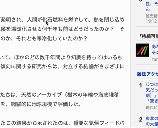

# (Chrome Extension) Translate to Hiragana with ChatGPT

This Chrome extension can translate selected Japanese text to Hiragana by using ChatGPT.

## Load extension in Chrome

1. Go to `chrome://extensions`.
1. Change to `Developer mode`.
1. Click `Load unpacked`.
1. Select "this" directory.

## Setup API key

1. Go to option page of the extension.
1. Put the OpenAI API key and save.

## Use it

1. Select some Japanese text on web page.
1. Right click and select "Translate to Hirgana".
1. Wait a few seconds.
